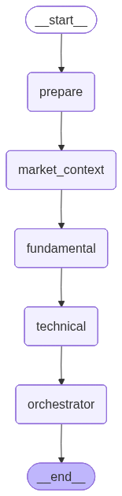

# Multi-Agent Trading System

This is a Python-based, multi-agent trading system designed to ingest raw financial data, synthesize market context, run parallel domain-specific analyses, and finalize a trading decision through a risk-aware orchestrator. 

It is built on top of LangChain and LangGraph, treating Large Language Models (LLMs) as deterministic "agents" inside a state machine workflow.

## Architecture and Workflow

Agentic systems solve complex problems by breaking them down into smaller, defined tasks. In this project, instead of passing everything to an LLM in a single prompt, we use LangGraph to construct a **Directed Acyclic Graph (DAG)**. 



The graph passes a shared state dictionary (`GraphState`) between specialized Python functions (called "nodes").

The workflow executes in the following sequence:

### 1. Data Ingestion (Linear)
- **Prepare Data Node:** Takes raw 5-minute OHLCV (Open, High, Low, Close, Volume) data retrieved via `yfinance` and formats it into a clean statistical text summary.
- **Market Context Node:** Calls external APIs (Finnhub) to enrich the state with current global indices, financial news headlines, and the "Fear & Greed" index.

### 2. Parallel Sub-agents
Once the data is prepared, the graph branches into two parallel paths. Both nodes receive the exact same dataset and system prompts, but are tasked with distinct analytical scopes:
- **Fundamental Analysis Sub-agent:** Evaluates the trade purely from a valuation, macroeconomic, and global sentiment perspective.
- **Technical Analysis Sub-agent:** Evaluates the trade purely based on price action, candlestick patterns, moving averages, and volume structures.

Both sub-agents are strictly constrained by Pydantic schemas to output a directional signal (`BULLISH`, `BEARISH`, `NEUTRAL`), a confidence score, and clear reasoning.

### 3. Orchestrator (Pass 1)
The parallel branches converge at the Orchestrator node. The Orchestrator acts as the "Portfolio Manager". It reviews the raw data summaries along with the structured outputs from both the fundamental and technical sub-agents. It synthesizes areas of conflict and agreement, ultimately producing an initial `BUY` or `SELL` decision alongside an entry price and risk notes.

### 4. Risk Manager Loop
Before the trade is finalized, the workflow moves to a dedicated Risk Manager node. 
- The Risk Manager does not generate trading signals; its sole purpose is to critique the Orchestrator's decision. 
- It attempts to find logical flaws, overconfidence, or ignored macro risks.
- It returns a verdict (`APPROVE`, `FLAG`, or `REJECT`).

### 5. Orchestrator (Pass 2 - Re-evaluation)
The system routes back to the Orchestrator node a second time. The Orchestrator is provided with its original decision, the full context, and the new Risk Manager critique. The Orchestrator is prompted to re-evaluate its stance logically, where it may reduce its confidence, alter its stop-loss levels, or completely flip its decision if the risk is deemed unacceptable. 

Once this final evaluation is complete, the workflow outputs the ultimate decision and terminates.

## Technical Stack
- **Dependencies:** Python 3.10+, LangGraph, LangChain, pandas, yfinance, python-dotenv
- **LLM Provider:** Groq (configured via OpenAI compatibility layer) using Llama 3 models. The factory pattern (`llm_factory.py`) abstracts the LLM instance creation, allowing easy injection of different providers (Anthropic, OpenAI) later.
- **State Management:** Strict `TypedDict` and Pydantic validation ensure structured inputs and outputs across all LLM boundaries.

## Running the System

1. Ensure your `.env` file is configured with the necessary API keys, specifically:
   - `GROQ_API_KEY`
   - `FINNHUB_API_KEY`

2. Activate the virtual environment provided by your package manager:
   ```bash
   source .venv/bin/activate
   ```

3. Run the main execution script:
   ```bash
   python main.py
   ```
   You will be prompted to enter a ticker symbol (e.g., `SBIN.NS`, `RELIANCE.NS`, `AAPL`). The system will fetch recent 5m candle data, evaluate context, and output structured reasoning to the console.
